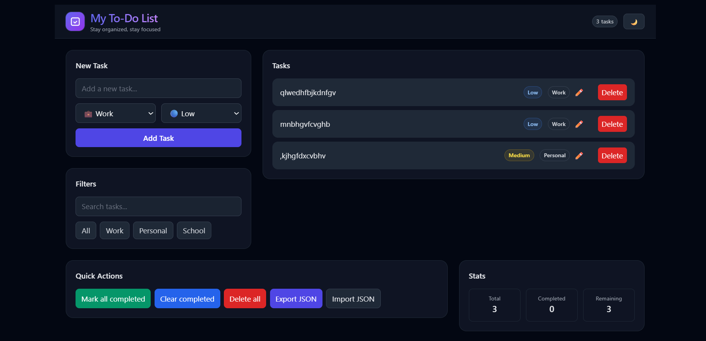

# To_Do_List_of_WEB_Application
# ✨ Advanced To-Do List App

A modern, responsive To-Do List application built with **HTML5**, **Tailwind CSS**, and **JavaScript**.  
This project demonstrates industry-relevant frontend practices such as DOM manipulation, data persistence with `localStorage`, responsive design, and clean code structuring.

---

## 🚀 Features

### ✅ Core Features
- Add new tasks quickly
- Mark tasks as complete/incomplete with visual indicators
- Delete tasks without refreshing the page
- Data persistence with **localStorage**

### 🎨 UI & Styling
- Responsive design (mobile, tablet, desktop) using Tailwind CSS
- Modern and accessible layout
- Dark mode toggle 🌙
- Distinct styling for completed, active, and priority tasks

### 🌟 Advanced Features
- Inline task editing ✏️
- Task categorization (Work, Personal, School)
- Priority levels (Low, Medium, High) with color-coded tags
- Search and filter functionality
- Smooth animations and hover effects

---

## 🛠️ Technologies Used
- **HTML5** – Semantic structure
- **Tailwind CSS** – Modern responsive styling
- **JavaScript (ES6)** – Dynamic DOM manipulation
- **localStorage** – Persistent task management

---

## 📷 Screenshots
![Dashboard Screenshot]

---

## 📂 Folder Structure
```bash
/to-do-app
│── /assets
│── index.html
│── README.md

## Clone the repository:

git clone https://github.com/Boldecca/To_Do_List_of_WEB_Application.git

## live link 

https://boldecca.github.io/To_Do_List_of_WEB_Application/